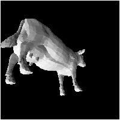
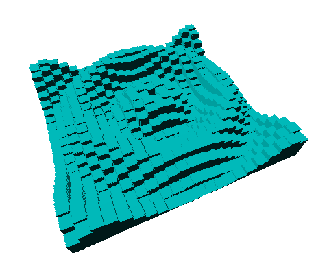
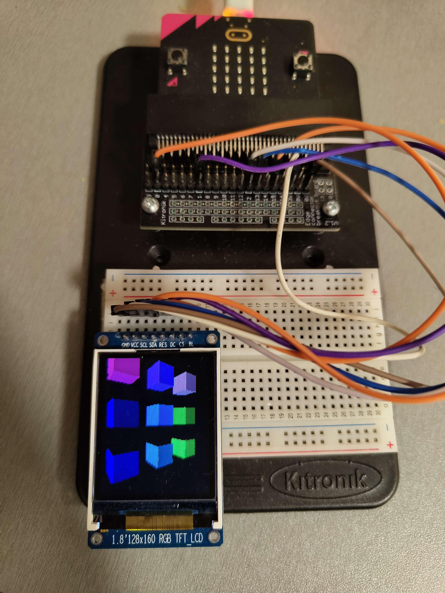

# IMEJ
- A 3d graphics engine written in C
- Completed as part of a third year project in computer science, awarded A+ grade
- This library enables 3D models to be loaded and manipulated in a scene and then rastered to a frame buffer
- Several possible uses of this framebuffer are included in the imej/examples directory

## Provided output drivers

- frame export as PPM images

- terminal ascii render

- X11 gui

- microbit tft display 

